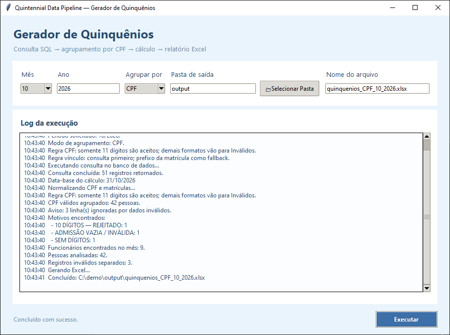

# GeradorDeQuinquenio — Quintennial Data Pipeline

[](https://github.com/LucasZeon/GeradorDeQuinquenio/actions/workflows/ci.yml)
[](https://github.com/LucasZeon/GeradorDeQuinquenio/actions/workflows/codeql.yml)
[](LICENSE)


A desktop tool that finds which employees complete a **five-year service milestone
("quinquênio": 5, 10, 15, 20… years)** in a given month/year, consolidating
several employment records per person into a single, auditable service history.

> **Portfolio version.** This is a sanitized public version of an internal tool.
> The original integrates with a corporate Oracle database. That integration,
> all credentials, internal identifiers and real data were removed; this version
> runs against a **local, fully synthetic SQLite database**. The business rules
> and the calculation algorithm are the ones used by the original tool.
> See [Security and sanitization](#security-and-sanitization).



> **Resumo em português.** Ferramenta desktop (Python + Tkinter) que apura quem
> completa quinquênio (5, 10, 15… anos de serviço) em um mês/ano, unificando
> várias matrículas da mesma pessoa (agrupamento por CPF ou por PIS), sem contar
> tempo em dobro nas sobreposições, ignorando hiatos e considerando apenas anos e
> meses completos. Gera um relatório Excel com abas de auditoria (Debug e
> Inválidos). Esta versão pública usa dados sintéticos e não depende de nenhum
> banco corporativo.

## The problem

Service milestones depend on the *person's* total time of service, but HR
systems store *employment records* (one row per registration number). The same
person can have several records over time, at different employers/entities, and
sometimes at the same time. Getting the milestone right means answering:

- Which records belong to the same person? (CPF or PIS, depending on data quality)
- Do simultaneous records count twice? (No.)
- What happens between two records — a gap, or a same-day hand-over?
- Is the day of termination worked time? Do partial months count?
- Which rows cannot be trusted, and why?

## Context

The tool started as an internal need: HR data lived in a database that stored one
row per employment record, and the milestone had to be computed per person. The
original queried that internal database directly and produced an Excel report.
(No production metrics are published here.)

## Solution

```text
SQL query (SQLite here, Oracle in production)
        ↓
Validation & normalization  ── invalid rows ──► "Inválidos" sheet (with reason)
  · CPF: exactly 11 digits
  · PIS: 11 digits kept; 12 digits → first digit dropped
  · badge number kept as text, left-padded to 8 digits
  · dates parsed / sentinel for "still active"
        ↓
Grouping by person (CPF or PIS, chosen in the UI)
        ↓
Business rules
  · merge overlapping intervals (no double counting)
  · same-day termination/admission = continuity (no gap)
  · gaps are not counted
  · termination date is exclusive
  · only whole months (day ignored, month/year respected)
  · the base date (last day of the chosen month) is a hard limit
        ↓
Milestone dates (60, 120, 180… months)  →  employees reaching one in the month
        ↓
Excel report: result, per-badge detail, general detail, Inválidos, Debug
```

### Business rules (as implemented)

| Rule | Example (base date 31/10/2026) |
|---|---|
| Only whole months count; the *day* is ignored, month and year are not | Admitted 01/11/2021 → 59 months → **not** yet 5 years. Admitted 01/11/2021 with base 30/11/2026 → 60 months → 5 years |
| Simultaneous records do not count twice | A record fully inside another adds nothing |
| Same-day termination/admission is continuity | No gap between the two records |
| Gaps without a record are not counted | 59 months + 121 months = 180 months → 15 years |
| Termination date is exclusive | Terminated 30/09/2026, admitted 01/10/2021 → 59 months |
| Main record = newest *active* record, or newest by admission if none is active | Used as the row shown in the result |
| Employer/entity comes from the query; the badge prefix is the fallback | `01`/`02`/`04` → `ENTITY A`/`B`/`C` |

## Technologies

Python · pandas · openpyxl · python-dateutil · Tkinter · SQLite (`sqlite3`) ·
pytest · GitHub Actions (CI, CodeQL, Dependabot).

## Main technical challenges

- **Identity across records.** The same person may have several registrations;
  grouping by CPF *or* PIS is selectable, and each has its own normalization
  rule. The PIS rule (12 → 11 digits) is what lets records with different
  formatting of the same PIS merge correctly.
- **Badge numbers are identifiers, not numbers.** They are handled as text with
  leading zeros restored (`1000001`, `1000001.0`, `01000001` → `01000001`).
- **Interval arithmetic with real-world edge cases.** Overlaps, hand-offs on the
  same day, gaps, open (active) records and exclusive termination dates — all
  covered by tests.
- **"Active" encoded as a sentinel date** in the source system (`1899-12-30`),
  translated to `ATIVO` in the query.
- **Auditability.** Rejected rows are never silently dropped: they go to the
  `Inválidos` sheet with the exact reason, and the `Debug` sheet documents the
  rules and shows the equivalent Excel formulas as text so the calculation can
  be cross-checked by hand.
- **Responsive UI.** The query and calculation run in a worker thread so the
  Tkinter window does not freeze.

## Project structure

```text
GeradorDeQuinquenio/
├── README.md · LICENSE · SECURITY.md
├── requirements.txt / requirements-dev.txt
├── src/
│   └── main.py                      # GUI + rules + report generation
├── data/
│   └── generate_synthetic_data.py   # builds data/synthetic_hr.db (fixed seed)
├── sql/
│   └── quintennial_query.sql        # extraction query (fictional schema)
├── docs/
│   ├── original-oracle-integration.md
│   └── img/gui.png                  # screenshot (synthetic data only)
├── tests/
│   ├── test_rules.py                # unit tests for the business rules
│   ├── test_pipeline.py             # DB → query → calculation → Excel
│   └── test_safety_checker.py       # repository-safety tooling
├── tools/check_public_safety.py     # leak checker (hook + CI)
└── .github/                         # CI, CodeQL, Dependabot
```

`src/main.py` is intentionally kept as the single application file of the
original tool. Splitting it into modules (with the test suite as a safety net)
is the planned next step — see [Roadmap](#roadmap).

## How to run

```bash
python -m venv .venv
.venv\Scripts\activate            # Windows (Linux/macOS: source .venv/bin/activate)
pip install -r requirements.txt

python data/generate_synthetic_data.py   # creates data/synthetic_hr.db
python src/main.py                       # opens the GUI
```

In the GUI choose the month/year (e.g. **10 / 2026**), the grouping mode (CPF or
PIS) and run. The report is written to `output/` by default. The database path
can be overridden with the `QUINTENNIAL_DB` environment variable.

### Tests

```bash
pip install -r requirements-dev.txt
pytest
```

## The synthetic dataset

`data/generate_synthetic_data.py` (fixed seed) creates a fictional schema
(`employee`, `department`, `employee_attribute`) with people named
`Employee 001…`, departments `Department 01…`, job titles `Job Title A…` and
entities `ENTITY A/B/C`. CPF/PIS values are random 11-digit strings with no
relation to real people (the tool validates only their length).

Named scenarios, for the base date **31/10/2026** (`EXPECTED` in the generator is
checked by the tests):

| Person | Situation | CPF mode | PIS mode |
|---|---|---|---|
| 001 | one active record, exactly 5 years | 5 | 5 |
| 002 | 59 months | – | – |
| 003 | two records, same-day hand-over | 15 | 15 |
| 004 | gap between records | 15 | 15 |
| 005 | overlapping records | 10 | 10 |
| 006 | terminated in the milestone month | 5 | 5 |
| 007 | terminated one day too early (exclusive end) | – | – |
| 008 | three records in three entities, chained | 15 | 15 |
| 009 | PIS with 12 digits on one record | 10 | 10 |
| 010 | CPF with 10 digits | invalid | 5 |
| 011 | empty CPF | invalid | 10 |
| 012 | PIS with 10 digits | 15 | invalid |
| 013 | missing PIS | 20 | invalid |
| 014 | empty admission date | invalid | invalid |
| 015 | admitted after the base date | – | – |

The generator also inserts rows that the query itself must filter out (reserved
technical badges and a company outside the filter).

## Security and sanitization

- No real data: names, badge numbers, CPF/PIS, departments, job titles and
  entities are synthetic.
- No credentials or database configuration: host, user, password, Oracle client
  and network configuration were removed. No secret is required to run.
- Internal infrastructure, table/column names and internal codes were replaced
  by a fictional schema.
- Organization and internal-system names were replaced by generic ones.
- The production query was adapted from Oracle SQL to SQLite; the logic (joins on
  an attribute table, sentinel date for active records, exclusion filter) is
  preserved. Details in [`docs/original-oracle-integration.md`](docs/original-oracle-integration.md).
- Reports (`*.xlsx`), databases, executables and packaging artifacts are ignored
  by `.gitignore`.

This is a public version of a real tool, not the production system.

## Repository safeguards

This repository is meant to stay free of real data and credentials, so several
layers protect it from accidental leaks:

1. **Allowlist `.gitignore`.** Everything is ignored by default; only the files
   listed explicitly are tracked. A new `.env`, key, spreadsheet or database
   never enters Git by accident. A second block of deny rules acts as a safety
   net if an allowlist entry is widened by mistake.
2. **`tools/check_public_safety.py`.** Blocks forbidden file types and looks for
   secrets, personal paths, IP/MAC addresses, formatted CPF/CNPJ, e-mails and
   random-looking tokens. It can also compare against a private list of
   sensitive terms and private values that are kept *outside* the repository.
   Reports show file and line, never the value.
3. **Pre-commit hook** (`.githooks/pre-commit`) runs the check on staged files.
   Enable it once per clone: `git config core.hooksPath .githooks`.
4. **CI** (`.github/workflows/ci.yml`) runs the same check and the test suite on
   every push.

```bash
python tools/check_public_safety.py --all      # everything Git would add
python tools/check_public_safety.py --staged   # what is about to be committed
```

## Roadmap

- Split `src/main.py` into modules (data source, rules, report, GUI) without
  changing behavior, guarded by the existing tests.
- Add a command-line entry point next to the GUI.
- Package the application for Windows from source (no binaries are stored in
  this repository).

## License

Released under the [MIT License](LICENSE).
